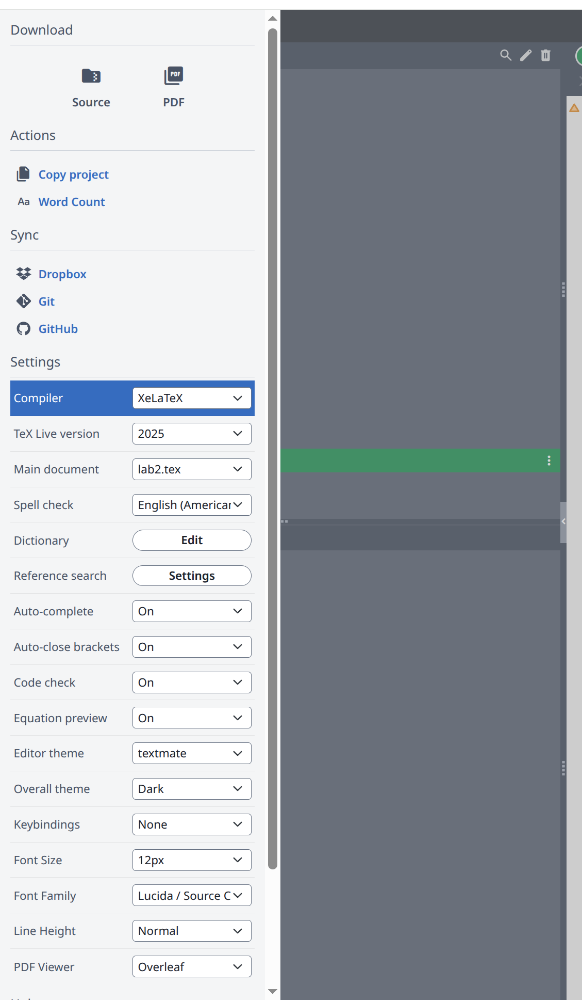

# 📝 Report Branch Guide

This branch provides a **LaTeX report template** for the Git + AI task.

---

## 📘 Files Included
- `main.tex` — main report file (edit this one)  
- `refs.bib` — optional reference file  
- `fig/` — folder for your images or screenshots  

---

## 🧩 How to Use

You can compile this report **directly on [Overleaf](https://www.overleaf.com)** or locally with LaTeX.

### ▶️ Recommended (Overleaf)
1. Create a new project on Overleaf.  
2. Upload all files in this branch (`main.tex`, `refs.bib`, and the `fig/` folder).  
3. Go to **Menu → Compiler → Select “XeLaTeX”**.  

4. Click **Recompile** — you’ll get your `report.pdf`.

> 💡 *Note:* The template supports both English and Chinese text.  
> If Chinese characters don’t display correctly, make sure the compiler is set to **XeLaTeX**, not pdfLaTeX.

---

## 🧠 Sections to Complete
Open `main.tex` and fill in:
1. **Project Introduction** — your game description  
2. **AI Prompts Used** — list all prompts you used  
3. **Git Workflow** — summarize your Git process and include 3–5 recent `git log` lines  
4. **Reflection** — what you learned  
5. *(Optional)* Add figures or screenshots in `fig/`

---

## 📤 When Done
1. Compile your report into `report.pdf`.  
2. Copy `report.pdf` to the root of your `main` branch.  
3. Commit and push your updates.

✅ **Final deliverable:** `report.pdf` included in your `main` branch.
